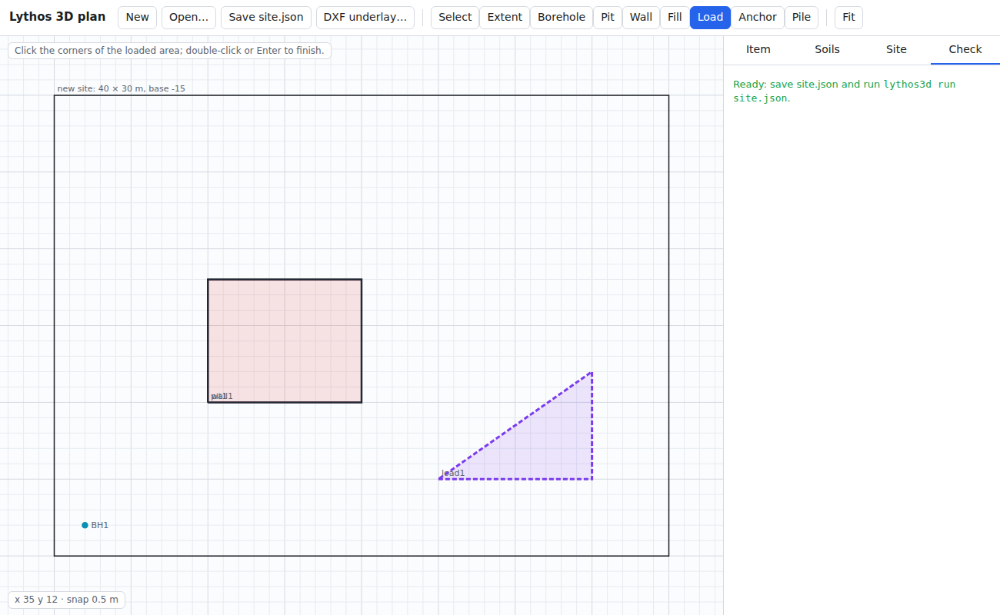
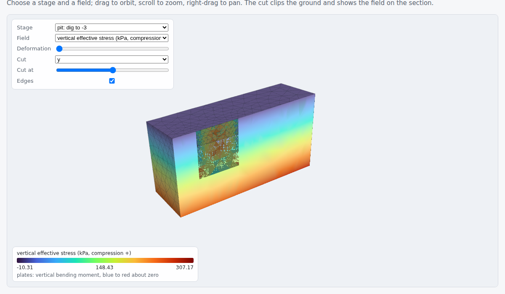

# Lythos 3D

Three-dimensional finite element analysis for geotechnical engineering: the 3D
counterpart of [Lythos](https://github.com/hdaltuntas/lythos).

Plane strain is the right idealisation for a long slope or a long wall, and the
wrong one for the corner of an excavation pit, a pile group, a raft, or a slope
whose failure is bounded at its ends. Lythos 3D is for those.

> **Status:** the planned scope is complete. The program covers ground from
> boreholes and plans drawn in the browser or taken from DXF. It analyses
> staged excavation and fill with walls, anchors, interfaces and embedded
> piles, and handles groundwater from hydrostatic to steady seepage,
> undrained loading and consolidation. Factors of safety come from strength
> reduction, and results go to a 3D report in the browser. Everything is
> verified against closed-form solutions, limit equilibrium and 2D Lythos;
> see [Verification](#verification).

## What works now

- **10-node quadratic tetrahedra**, fully vectorised: the 3D counterpart of
  the 6-node triangles Lythos uses, and chosen for the same reason. Linear
  tetrahedra lock badly under the constant-volume plastic flow that
  determines a factor of safety.
- **Ground from boreholes**: each soil's top is interpolated between the
  boreholes, so layers dip, and a soil missing from a borehole pinches out.
  The K0 initial stresses come from the same profile.
- **Excavations drawn in plan**: any polygon, dug in lifts to given levels.
- **gmsh meshing** (OpenCASCADE): the ground surface, the soil interfaces and
  every lift are honoured, and the mesh is refined round the pits. It also
  grades away from the millimetre-long edges that a dipping layer leaves
  where it grazes a pit corner.
- **Site files**: the whole model as JSON, analysed with `lythos3d run`.
  Any pit, wall, fill or load outline may come from a DXF plan by layer
  (`{"dxf": "plan.dxf", "layer": "PIT"}`); `lythos3d dxf plan.dxf` lists what a
  drawing holds.
- **Layered ground in a box**: a structured mesh without gmsh, for quick
  models and verification.
- **Loads**: self weight, uniform tractions on any part of a boundary
  plane, and loads drawn in plan (`AreaLoad`, kPa of plan area, with an
  optional horizontal part) that bear on the ground surface as it is at that
  stage: sloping, dug or built up. Point loads on pile heads.
- **Box restraints**: a fixed base, and sides on rollers.
- **PARDISO**: Intel's parallel sparse direct solver, through `pypardiso`.
  SciPy's SuperLU cannot factorise a 3D model of useful
  size in reasonable time or memory.
- **Mohr-Coulomb** with a tension cut-off and non-associated flow: the 2D
  exact return mapping in principal stresses, carried into six stress
  components with its consistent tangent.
- **Staged construction**: K0 or gravity initial stresses, excavation by
  removing volumes of ground in lifts, surface loads per stage.
- **Fill**: embankments and platforms drawn in plan (`SiteFill`) or as
  blocks (`Fill`), placed lift by lift above the irregular ground, and
  backfill that takes its own material where ground was dug out. New
  ground starts free of stress.
- **Factor of safety** by strength reduction.
- **Walls and rafts**: 6-node flat shells sharing their nodes with the soil,
  specified by `E`, `ν` and thickness, or by `EA` and `EI` per metre.
  Installed at a stage, stress-free in the ground as it has deformed.
  Reports membrane forces, moments and shears.
- **Anchors and struts**: bars between two nodes or to a fixed point,
  stressed to their lock-off load in the stage that installs them
  (positive for an anchor, negative for a strut jacked against the wall).
- **Wall–soil interfaces**: zero-thickness Mohr-Coulomb contact on both
  faces of a wall. The contact slips at `c_i + σn tan φ_i`, opens a gap
  under tension, and ties the ground rigidly until the wall is installed.
  Its strength is `R` times the soil's, or a wall friction angle given
  directly; strength reduction weakens it with the soil.
- **Embedded piles**: 3D Timoshenko beams that run through the mesh
  wherever they are put, tied to the soil at their perimeter. Skin
  friction is capped at a capacity per metre, and the tip takes end bearing
  up to its own capacity and can lift off. Loads go on the pile head, and
  the output gives axial force, shear and moment along the pile, the skin
  friction and the base force.
- **Walls drawn in plan** on a gmsh site: a polyline with a toe level,
  reaching the ground or a given top. A wall may stop short of the base,
  in which case it is embedded in the soil. Anchor ends become exact nodes.
- **Groundwater**: a phreatic level, constant or read from boreholes, with
  hydrostatic pore pressure below it, in a drained effective-stress
  analysis. Soils weigh `gamma_sat` below the water. The water presses on
  walls and on flooded pit floors. A pit can be pumped dry to each
  formation level as it is dug, and each stage may set its own water table.
  ParaView gets pore pressure and total stress.
- **Steady seepage**: the head solved over the ground, with the phreatic
  surface and seepage faces found by the solution, anisotropic
  permeability per soil, walls with interfaces impermeable. Water comes in
  under the toe of a wall into a pumped pit, and the flow the pumps must
  lift is reported. Its pore pressures load the soil as the hydrostatic ones
  do, stage by stage.
- **Undrained loading** (undrained A and B): effective stress with the pore
  water as a stiff bulk spring (`nu_u` = 0.495), excess pore pressure
  tracked point by point, and undrained strength from `c'`, `φ'` or given as
  `su` (growing with depth if need be). A stage marked `drained` lets the
  excess pore pressure dissipate and the soil consolidate.
- **Consolidation in time** (Biot): displacement and excess pore pressure
  solved together (Taylor–Hood), stage by stage over a given time, with
  the ground surface and chosen box sides drained. Settlement and pore
  pressure against time come with each stage.
- **ParaView output** (`.vtu`): displacements, smoothed stresses and plastic
  strain on quadratic cells, stage by stage, with excavated ground left out.
- **Browser**: a plan editor to draw a site, and an HTML report with a 3D
  viewer (contours, deformed shape, cut planes) that opens offline.

## Installing and trying it

```bash
python -m venv .venv
source .venv/bin/activate
pip install -e ".[dev]"

lythos3d info                    # versions, and which linear solvers are available
lythos3d demo -o out             # a footing on sand over clay -> out/footing.vtu
lythos3d pit -o pit              # a square pit dug in two lifts, then its factor of safety (~7 min)
lythos3d pit --trench -o trench  # the same section as a long trench, in plane strain (~1 min)

lythos3d site-example -o site.json   # boreholes, dipping layers, a walled and strutted pit
lythos3d site-example --water -o wet.json   # the same below the water table, pumped dry as dug
lythos3d site-example --seepage -o flow.json   # the same with the flow into the pit solved
lythos3d editor -o editor.html       # draw a site in the browser and save its site.json
lythos3d dxf plan.dxf                # list the layers of a DXF plan, to use its outlines
lythos3d mesh site.json -o mesh.vtu  # mesh it; report element quality per soil and lift
lythos3d run site.json -o run        # stage by stage, then the factor of safety -> run/report.html
pytest
```

Meshing needs gmsh, which comes with `pip install -e ".[dev]"` (or
`pip install gmsh`). On a server or container with no display, the gmsh wheel
also needs a few system libraries:

```bash
sudo apt install libglu1-mesa libxcursor1 libxinerama1 libxft2
```

Alternatively, install gmsh's build without X:
`pip install -i https://gmsh.info/python-packages-dev-nox gmsh`.

From a clone without installing, `python main.py info` and
`python main.py demo` do the same. You will need NumPy, SciPy and, on x86-64,
`pypardiso`.

```
30720 elements, 44649 nodes, 125400 equations
assembled in 8.48 s, solved by pardiso in 8.36 s
settlement under the centre of the footing: 14.8 mm
```

## In the browser

`lythos3d editor` writes a plan editor: a single HTML file that works
offline. In it you draw the model extent, boreholes, pits, walls, fills,
area loads, anchors and piles, enter the soils and the water level, and save
a `site.json` that `lythos3d run` takes as it is. A DXF plan can be loaded
underneath and its polylines picked up with a click.



`lythos3d run` writes `report.html` next to the ParaView files. The report
has:

- the materials;
- a table of every stage: displacement, factor of safety, plastic points,
  wall moments, anchor forces, seepage flows and consolidation;
- charts: the strength reduction search, consolidation against time, wall
  moment envelopes against level, and pile axial forces;
- a 3D viewer (three.js, included in the file, so it opens offline). It
  shows any stage, coloured by displacement, stress, plastic strain, pore
  pressure or head, with a deformation scale and a cut plane that shows the
  field on the section.

From a script, `lythos3d.io.viewer.write_report(path, problem, results)` does
the same.



## From a script

A square pit, a quarter of it by symmetry, dug in two lifts:

```python
from lythos3d.core.materials import MohrCoulomb
from lythos3d.core.model import Model, Stratum, Volume
from lythos3d.core.problem import Stage
from lythos3d.io.vtu import write_stage

clay = MohrCoulomb("sandy clay", E=2.5e4, nu=0.3, gamma=19.0, c=12.0, phi=26.0)
stiff = MohrCoulomb("stiff clay", E=6.0e4, nu=0.3, gamma=20.0, c=25.0, phi=24.0)

model = Model(
    name="pit", x=(0, 13), y=(0, 13), bottom=-10,
    strata=[Stratum("sandy clay", clay, 0.0), Stratum("stiff clay", stiff, -4.0)],
    volumes=[Volume("lift 1", (0, 0, -1.5), (4, 4, 0)),
             Volume("lift 2", (0, 0, -3.0), (4, 4, -1.5))],
    stages=[Stage("initial", kind="initial", initial_stress="k0"),
            Stage("dig to -1.5", excavate=("lift 1",)),
            Stage("dig to -3.0", excavate=("lift 2",)),
            Stage("factor of safety", kind="ssr")],
    mesh_size=1.5,
)
problem, results = model.run(verbose=True)
print(results[-1].factor_of_safety)               # 1.18; the same section as a trench: 0.92
for k, r in enumerate(results):
    write_stage(f"pit_{k}.vtu", problem, r)
```

The x = 0 and y = 0 planes are on rollers, as are the far sides, so they act
as planes of symmetry. For a single load case on elastic ground,
`lythos3d.core.analysis.linear_static` does without stages.

With groundwater, give the soils a saturated weight and the model a water
table. A stage can change it, here pumping the pit down to its floor:

```python
from lythos3d.core.water import WaterTable

clay = MohrCoulomb("sandy clay", E=2.5e4, nu=0.3, gamma=19.0, gamma_sat=20.0, c=12.0, phi=26.0)
water = WaterTable(level=-1.0)            # or WaterTable(wells=[(x, y, level), ...])
pumped = water.lowered([(0, 0), (4, 0), (4, 4), (0, 4)], -3.0)
# Model(..., water=water, stages=[..., Stage("dig to -3.0", excavate=("lift 2",), water=pumped), ...])
```

For the flow itself rather than a level, give `Seepage(water)` instead
(`k` and `k_v` on the soils set their permeability). The head, Darcy
velocity and flows (`result.flows["pumped"]`) come with each stage.

A clay loaded undrained takes `drainage="undrained"`, with effective
parameters, or with `phi=0.0, c=su` (and `c_inc`, `z_ref` for a strength
growing with depth). `Stage(..., drained=True)` lets its excess pore
pressure go. `result.excess_pore_pressure` holds it, and it is part of
`result.pore_pressure`. `Stage("wait", kind="consolidation", time=30,
drained_sides=("base",))` lets 30 days pass (with `k` in m/day), and
`result.consolidation` lists time, largest excess pore pressure and
largest displacement after every step.

The stresses reported are effective. `result.pore_pressure` holds the pore
pressure at the Gauss points, and ParaView gets `pore_pressure` and
`total_stress` as well. On a `Site`, an excavation with `dewatered=True`
is pumped down to each formation level in the default stages.

Units are kN, m and kPa, as in Lythos. `z` points up, and stresses are
tension positive, stored in the order `[xx, yy, zz, xy, yz, zx]`.

## Linear solver

| | PARDISO (`pypardiso`) | SuperLU (SciPy) |
| --- | --- | --- |
| 25k equations | 0.8 s | 20 s |
| 195k equations | 16–20 s (Cholesky), 40 s (LU) | not finished after 10 min, 13 GB in use |

PARDISO is installed automatically on x86-64 Linux and Windows. It is not
built for ARM, so on Apple silicon Lythos 3D falls back to SuperLU and warns;
keep models small there. Elastic stiffness matrices are factorised by
Cholesky, which takes half the time and memory. The elasto-plastic tangent is
unsymmetric under non-associated flow, so it will use LU.

On Debian and Ubuntu, a system-wide `pip` puts MKL under `/usr/local/lib`,
where `pypardiso` does not look. Lythos 3D finds it there itself. If MKL is
somewhere else entirely, set `PYPARDISO_MKL_RT` to the path of `libmkl_rt`.

## Verification

Every row is a test in `tests/`:

| Check | Reference | Lythos 3D |
| --- | --- | --- |
| Patch test, linear field, distorted mesh | constant strain | exact to 1e-12 |
| Rigid body modes of one element | 6 | 6 |
| Geostatic stress under self weight | `σv = γz`, `σh = K0 σv` | exact |
| Settlement profile under self weight | `w = γ/M (H z − z²/2)` | exact |
| Uniform surcharge | `qH/M` | exact |
| Two-layer column | sum of layer compressions | exact |
| Cantilever tip deflection (2 elements through the depth) | `PL³/3EI + PL/κGA` | within 1% |
| Footing symmetry | x ↔ y swap | exact |
| Singular (unrestrained) model | must be refused | refused |
| Mohr-Coulomb triaxial strength | `σ1 = σ3 Kp + 2c√Kp` | within 1e-6 |
| Consistent tangent | finite-difference derivative | within 1e-9 E |
| K0 procedure, layered ground | `σh = K0 σv`, no imbalance | exact, zero iterations |
| Excavating a layer | heave `γ h H / M` | exact |
| 2:1 slope as a plane-strain slice (`pytest -m slow`) | 2D Lythos: 1.430 | 1.430 |
| Soil tops between boreholes | linear interpolation, exact at the holes | exact |
| Layer volumes, 3 boreholes, dipping strata, pinch-out | independent quadrature | within 0.2% (0.02% measured) |
| Level strata and pit lifts through gmsh | `area × thickness` | exact |
| Same site meshed twice | identical mesh | identical |
| JSON site description | round trip | lossless |
| Plate element | 6 rigid body modes, no spurious ones | 6 |
| Plate membrane patch test, tilted | constant forces | exact |
| Cantilever strip, L/t = 10 to 1000 | `PL³/3EI + PL/κGA` | within 0.3% |
| Simply supported square plate (Navier) | `0.00406 q a⁴/D` | within 1% (12 × 12), 3% (4 × 4, t/a = 0.005) |
| Raft on a restrained column | `(q + w) H / M`, no moment | exact |
| Anchor lock-off | `P₀`, then `P₀ + EA/L Δ` | exact |
| Cantilever wall, plane-strain slice (`pytest -m slow`) | 2D Lythos: 9.83 kNm/m, 1.22 mm | 9.65 kNm/m, 1.21 mm |
| Wall drawn in plan round a pit, level and sloping ground | area below ground | within 0.01% |
| Wall faces | faces of the tetrahedra | all |
| Anchor ends inside the soil | exact nodes | exact |
| Walled pit, gmsh site against structured box (`pytest -m slow`) | box: 0.34 mm, 30.5 kNm/m | 0.34 mm, 32.2 kNm/m |
| Interface tangent, sticking, sliding and open | finite-difference derivative | exact |
| Block sliding on an interface (`pytest -m slow`) | slips at `c A + N tan φ` | holds at 98%, slides at 102%, equilibrium to 1e-6 |
| Uninstalled wall with interfaces | continuous ground | within 1e-4 |
| Wall friction: bonded, R = 1, R = 0.67 | each moves more | 1.09, 1.28, 1.68 mm |
| 3D beam: rigid modes, cantilever in any direction, axial, torsion | closed form | exact |
| Pile head load | carried by skin + base | to 1e-6 |
| Pile axial capacity | `(T_top + T_tip) L / 2 + F_max` | holds at 97%, not at 103% |
| Embedded pile against a pile of solid elements (`pytest -m slow`) | 1.22 mm settlement, 0.67 mm lateral | 1.28 mm, 0.72 mm |
| Pore pressure below a water table, level or from boreholes, with drawdowns | `γw (h − z)` | exact |
| K0 under water: in the ground, at the surface, standing above it | `σv' = σv − p`, no imbalance | exact, nothing moves |
| Gravity loading under water | `σ' = γ' z`, total `γsat z` | exact |
| Lowering the water table | `γw/M (d²/2 + d(H − d))` | exact |
| Water thrust on a wall with interfaces, dewatered on one side | `½ γw (h₁² − h₂²)` | within 1e-6 |
| Flooded excavation | same as digging buoyant dry soil | exact |
| Seepage along and across layers | `W Σ kᵢ tᵢ ΔH/L`, `ΔH / Σ Lᵢ/kᵢ` | exact |
| Rectangular dam, free surface and seepage face (Charny) | `k (H₁² − H₂²)/2L` | within 3.3% (0.8% with `psi_k` = 0.2) |
| Pumped pit behind an impermeable wall | all inflow pumped, less with a deeper wall | to 1e-6 |
| Area load in plan on sloping, then dug ground | resultant `q × plan area` | to 1e-9 |
| Fill layer over the site | `γf t H / M`, fill under its own weight | exact |
| Embankment drawn in plan over sloping ground, two lifts | volume above the ground | within 2% |
| Undrained then drained 1D loading | `qH/(M + Kw/n)`, then `qH/M` | exact |
| 1D consolidation, one- and two-way drainage | Terzaghi | settlement within 0.5% (40 steps) |
| Strip footing on undrained clay, slice (`pytest -m slow`) | Prandtl `(2 + π) su` | 3.1% over (0.5 m), 1.6% (0.25 m) |

At the same element sizes the plane-strain slice follows 2D Lythos to within
0.5%, and falls with refinement the same way towards Bishop's 1.379:

| Element size | 2D Lythos | Lythos 3D slice |
| --- | --- | --- |
| 2.5 m | 1.430 | 1.430 |
| 2.0 m | 1.409 | 1.402 |
| 1.25 m | 1.374 | 1.374 |

With a phreatic line rising from the toe to 6 m under the crest, Bishop
gives 1.187, 2D Lythos 1.184 (1.25 m) and 1.163 (0.75 m), and the slice
1.163 (1.25 m). The figures are in `docs/theory.md`.

### What plane strain cannot see

The same slope, cut to a finite width and held at its ends by rough rigid
walls. The mesh has 2.5 m elements, and each width was run once:

| Width | Factor of safety |
| --- | --- |
| 10 m | 1.839 |
| 20 m | 1.589 |
| 40 m | 1.501 |
| infinite (plane strain) | 1.430 |

The ends carry part of the sliding mass, so a narrow slope is markedly safer
than its cross-section suggests. The factor falls towards the plane-strain
value as the slope widens. Rough rigid end walls are the most favourable
case; real ends lie somewhere between them and plane strain.

A strength reduction factor is found to within its bisection bracket
(0.007). Near failure, whether a single trial converges depends on
round-off, and PARDISO's parallel factorisation does not fix the order in
which it sums. So a repeated run can land one bracket lower.

## Roadmap

1. ~~**Core**: quadratic tetrahedra, elastic solution, PARDISO, ParaView output.~~
2. ~~**Plasticity and staging**: Mohr-Coulomb in six stress components, K0
   and gravity initial stresses, excavation in lifts, strength reduction,
   checked against 2D Lythos in plane strain.~~
   ~~Groundwater, hydrostatic pore pressure and steady seepage.~~
   ~~Undrained analysis.~~
   ~~Constructing volumes (fill), consolidation in time.~~
3. ~~**Geometry**: soil layers from boreholes, excavations drawn in plan,
   meshed by gmsh, site files.~~
   ~~Ground loads on an irregular surface, DXF plan import.~~
4. **Structures**: ~~plates for walls and rafts, anchors and struts, walls
   drawn in plan for gmsh sites~~.
   ~~Soil–wall interfaces, embedded piles~~.
5. ~~**Interface**: a three.js viewer for contours and cut planes, a plan
   editor, DXF plan import and an HTML report.~~

Beyond this scope, natural next steps would be a stiffness that depends on
stress (hardening soil), more interface types (between soils, under rafts)
and dynamic loading.

## Licence

MIT.
